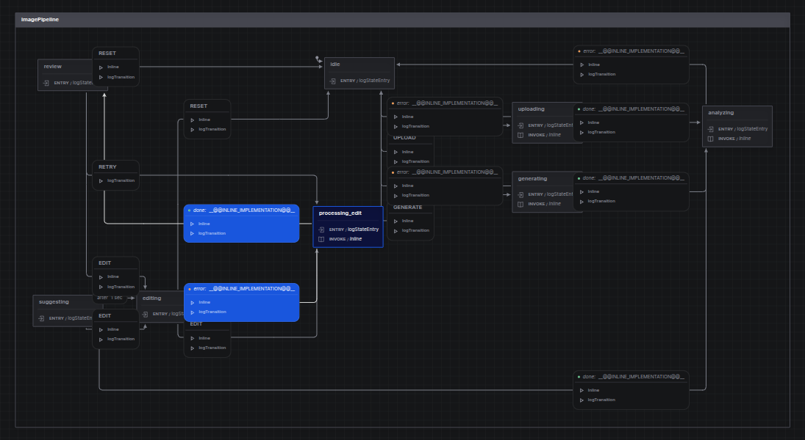

# vision-refiner

A pipeline for suggesting and applying contextual edits to an AI generated images.

## Future 

It would be good to an initial analysis of the uploaded image using something like Meta SAM (https://huggingface.co/facebook/sam3), do segmentation and object detection. From this, we can provide the user with some relevant editing suggestions. 

# Discussion points

 * Why did you choose the AI tools/Saases that you chose? What are the tradeoffs, and are there alternatives to consider?

 * Your approach to orchestrating the process and managing intermediate states.

 I opted to use Xstate.js. I've used this on a few other projects, and while it can be a bit (not nessarily a big) learning curve, I've found it good. 
 And for this particular project, where the workflow, orchestration, and potentially persisting a complex state can be very useful, xstate is really helpful. 

 It also allows for visualizing the state machine.

 [!statemachine.png]
 

 
 * Are there things you'd do differently if this was a production-grade system?

 Lots! 

 From a product / user experience perspective it would be good to being the experience by immediately analyzing the image, and providing suggestions. The workflow is designed for this. But to do this it would be better to use other models. 

 Also, persisting state, prompts and image edits would be help the user experience. 

